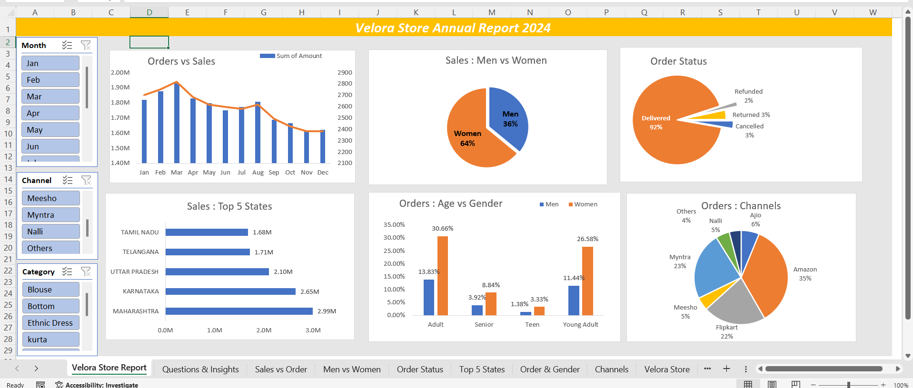

# 📊 Velora Store – Annual Business Report 2024

Welcome to the official Excel-based business analytics dashboard for **Velora Store's 2024 performance review**.  
This project highlights how Excel can be used to solve real-world problems by turning raw data into actionable insights and interactive visualizations.

---

## 🔍 Project Objective

To analyze the annual sales performance of Velora Store and uncover:
- 📈 Growth trends
- 🛍️ Product performance
- 📍 Regional sales variations
- 👥 Customer behavior patterns
- 💰 Revenue and return insights

---

## 🔗 Live Dashboard Preview

✨ Experience the dashboard without downloading the file:

👉 [**Click here to open in Excel Online**](https://1drv.ms/x/c/7c06b533acc30df6/EbI7LMQJf6REteAWN4ra0dMBZsclHuWDOIvczh02OSkAsA?e=dsagc9) *(via OneDrive)*

> 📌 Interactive features include slicers, dynamic charts, and segment-wise filters.

---

## 🖼️ Visual Dashboard Preview

---

## 📁 Project Files

| File Name                         | Description                                                        |
|----------------------------------|--------------------------------------------------------------------|
| `Velora_Store_Data_Analysis.xlsx`| Excel dashboard with interactive charts, slicers, and KPIs         |
| `Virohan_Store_Data_Analysis.png`| Snapshot preview of the Excel dashboard                            |
| `README.md`                      | Project overview, objectives, and insights documentation           |

---

## 💼 Business Challenges Identified

- Low product performance in specific regions
- Fluctuating seasonal demand affecting inventory
- High return rates in selected categories
- Inconsistent delivery timelines in Tier-2 zones

---

## 🔎 Key Insights Derived

- 🔝 **Category A** dominated sales in Q2 and Q4
- 📉 **Region South-West** consistently underperformed
- ♻️ High return rates were concentrated in **Apparel XL** sizes
- 💹 Festive months (Oct–Dec) drove 40% of total annual revenue

---

## ✅ Strategic Recommendations

- Optimize marketing spend towards high-yielding regions
- Streamline supply chain during festival peaks
- Introduce stricter QC for frequently returned items
- Focus on scalable SKUs with high turnover

---

## 🧰 Tools & Skills Used

- **Microsoft Excel**: PivotTables, Slicers, Charts, Conditional Formatting
- **Data Cleaning**: Structured formatting, sorting, error handling
- **Visualization**: Comparative bar charts, line graphs, KPI indicators
- **Version Control**: GitHub repository for version tracking and collaboration

---

## 🙋‍♂️ Author

**Md Arbaz Hasan**  
🔗 [GitHub Profile](https://github.com/mdarbazhasan)  
🔗 [LinkedIn Profile](http://www.linkedin.com/in/mdarbazhasan)
